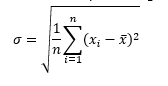
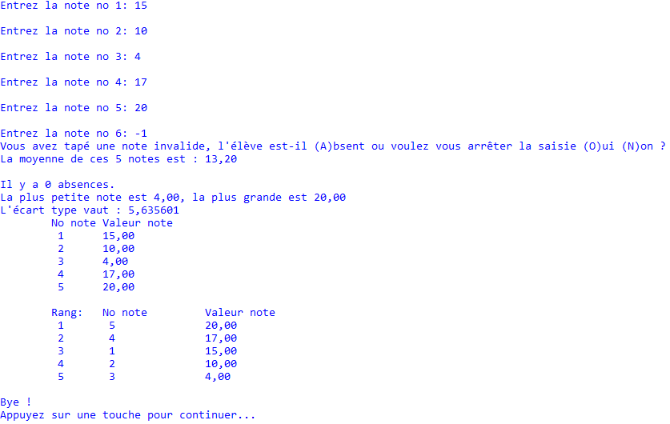
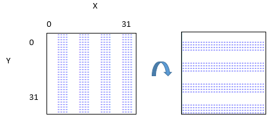

# TP C no 3

## Objectifs:

Comprendre et mettre en œuvre les structures algorithmiques de bases en langage C

Thèmes principaux :

Directive \#define – Opérations sur les bits – Tableaux statiques à une dimension

## Modalités :

Le TP est disponible sous la forme d'un dépôt Github distribué de manière privée et nominative à l'ensemble des étudiants. Utilisez le lien communiqué sur Team pour activer votre dépôt.

Le TP est fourni sous la forme d'une solution Visual Studio 2022.

Nous vous invitons à réaliser un 'commit' après chaque exercice et à pousser l'ensemble du travail sur GitHub dès la fin de séance.

## Exercice 1

Définir la « macro » suivante : 
```c
#define carre(x) x * x
```


Déclarer une variable « nb » entière et égale à 5 et afficher la valeur de carre(nb).

Afficher en suite le carre(nb+1), quel est le résultat obtenu ? D’où vient le problème à votre avis ? Proposer une modification de la macro pour qu’elle fonctionne.

  

## Exercice 2

Rappel :

Même si un entier est représenté la plupart du temps en base 10 dans le code C : ex 65535,  la représentation interne des données est réalisée en binaire, c'est-à-dire que c'est une suite  de 0 et de 1 qui est manipulée et stockée.  
  
Un premier exercice simple va consister à regarder ce que valent les 32 bits d'un entier non signé ayant la valeur 2868838400 en base 10, soit AAFF0000 en hexadécimal. En commençant par le bit de poids faible, afficher ON quand le bit vaut 1 et OFF quand il vaut 0. Présenter le résultat sous la forme de colonnes correctement alignées :

a.       Afficher tout d'abord le nombre d'octets utilisés pour représenter le nombre entier.

b.       Afficher le nombre de bits utilisés pour représenter le nombre entier.

c.       A l'aide d'une boucle, d'un opérateur de décalage à droite >> ou à gauche <<  et d'un opérateur de bit ET ( &), tester la valeur de chaque bit et afficher l'état correspondant (ON/OFF).

d.       L'affichage se présente avec un alignement du no de bit sur 2 caractères, comme suit :  
…  
bit  8 : OFF  
bit  9 : OFF  
bit 10 : OFF  
bit 11 : OFF  
…

e.       Vérifier à l'écran que tous les bits sont affichés et que l'état correspondant est exact.

f.        Le programme affiche un message de courtoisie avant de se terminer : Bye !

  

## Exercice 3

Rappel :

Un tableau est une collection de données du même type.  
la taille du tableau est définie à la compilation et ne peut pas être modifiée.  
Un tableau peut avoir plusieurs dimensions.

Chaque élément du tableau est identifié par un indice allant de 0 à nb éléments -1  
En C, le nombre d'éléments que peut contenir un tableau n'est pas fourni par le langage.
Il est toutefois possible de connaitre le nombre d'OCTETS qu'il occupe en mémoire (sizeof() ).
Exemple de tableau statique à une  dimension :
```c
// déclaration d'une variable de type tableau d'entiers :  
int temperature[12];  
// écriture de valeurs dans le tableau :  
temperature[0] = 25;  
temperature[11] = 8;  
// lecture de valeurs du tableau :  
ecart_temperature = temperature[11] – temperature[0];

```


  
Cet exercice a pour but de calculer une moyenne de notes entrées au clavier par l'utilisateur. Dans un premier temps, on choisit de ne pas mémoriser les notes. Puis en vue de produire un état des notes, le programme est complété et dispose d'un tableau. Il sera donc possible de procéder à différents traitements sur les notes sans être obligé de les saisir à nouveau.

a.       Ecrire un programme qui demande à l'utilisateur d'entrer des notes comprises entre 0 et 20 inclus avec une précision de deux chiffres après la virgule. Le message est " Entrer la note no _[indice]_ : "

b.       Une valeur en dehors de ces limites provoque la question "Elève absent ? ou voulez-vous arrêter la saisie des notes ? A/O/N". Sans action particulière, la saisie s'arrête après l'entrée de la 30ème note. Si la saisie des notes reprend et qu'il ne s'agit pas d'une absence, il faut ressaisir et prendre en compte la note en cours. Aide pour lire un caractère unique sur la console : [https://docs.microsoft.com/en-us/cpp/c-runtime-library/reference/getch-getwch](https://docs.microsoft.com/en-us/cpp/c-runtime-library/reference/getch-getwch) et pour traiter différents cas avec un switch : [switch Statement (C) | Microsoft Docs](https://docs.microsoft.com/en-us/cpp/c-language/switch-statement-c?view=msvc-160)  

c.       A l'issue de la saisie, le programme affiche le nombre de notes valides, le nombre d'absences, la moyenne des notes valides, la plus petite et la plus grande note valide.

d.       Déclarer une variable _note_ de type tableau et modifier le programme pour y ranger les notes.  
Les notes des élèves absents sont représentées par la valeur -1 dans le tableau de notes et n'entrent pas en compte dans le calcul de la moyenne.  
Astuce : Utiliser une variable qui indique le niveau de remplissage du tableau de notes.  
Contrainte : Utiliser une directive #define NBMAXNOTES 30 pour définir une constante de taille du tableau note. Dans la suite du code, on ne doit jamais retrouver la valeur 30 autrement que sous la forme NBMAXNOTES.

e.       Initialiser le tableau de notes avec la valeur arbitraire -2.

f.        A l'issue de la saisie et en plus des informations précédemment affichées, calculer et afficher l'écart-type avec une précision de deux chiffres après la virgule.




g.       Afficher le tableau de notes.

h.       Afficher un classement des notes par valeurs décroissantes.  

Idée : créer une copie du tableau de notes et un tableau d'index (les indices de chaque note) qui sera trié en même temps que la copie du tableau _note_. Il ne faut pas trier le tableau de notes lui-même.

Utiliser la méthode du tri à bulle.

L'affichage se fera de la manière suivante :



  

## Exercice 4

**Question a** : Compléter le code en langage C de la fonction bool readBit(int n, int pos)  
qui, à partir d’une valeur entière **n** codée sur 32 bits, renvoie **true** si le bit en position **pos** vaut **1** et **false** si le bit vaut **0**.

La valeur de **pos** est comprise entre 0 pour le bit de poids fort et 32 pour le bit de poids faible, de gauche à droite donc. 

Par exemple l’appel de la fonction readBit( 0x00000A0A , 30 ) renvoie **true**.

```c
/// <summary>

/// Lecture de la valeur du bit en position pos dans l’entier n en partant de 0 pour le bit de poids fort.
/// renvoie vrai si 1, ou false si 0
/// </summary>
/// <param name="n">entier à évaluer</param>
/// <param name="pos">bit à tester</param>
/// <returns>bit state</returns>

bool readBit(int n, int pos) {

       bool state = false;

       //

//

       return state;

}
```


**Question b :** Compléter le code en langage C de la fonction int writeBit(int* n, int pos)  
qui modifie la valeur de l’entier **n** codé en positionnant à 1 le bit en position **pos**. Le bit reste à 1 s’il est déjà à 1 et on ne modifie pas les autres bits.

La valeur de **pos** est comprise entre 0 pour le bit de poids fort et 32 pour le bit de poids faible, de gauche à droite donc. 

Par exemple : Avec n= 0x00000A0A, l’appel de la fonction writeBit( &n , 0 ) modifie **n** et renvoie également cette valeur 0x80000A0A par le return.

```c
/// <summary>

/// Modifie la valeur de l’entier n en positionnant à 1 le bit en position pos en partant de 0 pour le bit de poids fort.
/// </summary>
/// <param name="n">: entier à modifier</param>
/// <param name="pos">: bit à positionner à 1</param>
/// <returns>value of n</returns>

int writeBit(int* n, int pos) {


       return *n;

}
```
  

Un bitmap est une cartographie binaire qui comporte donc des 0 et des 1. On décide de travailler avec des bitmaps carrés de taille 32x32. Celle-ci peuvent être stockées dans un tableau de 32 entiers.

**Question c** :

On souhaite réaliser la rotation de ce bitmap d’un quart de tour dans le sens des aiguilles d’une montre :



Les octets sont manipulés sous la forme d’un tableau statiques d’entiers (32 bits). Cela permet de manipuler les données binaires par paquets de 32 bits et d’utiliser les fonctions readBit et writeBit pour lire et modifier les 32 bits d’une ligne du bitmap.

Une ligne de points correspond à une valeur du tableau d’entiers qui comporte donc 32 valeurs de type **int** représentant chacune des 32 lignes.

Lors de la rotation d’un quart de tour, on sait qu’un point qui se trouve maintenant en position  
**( x , y)** se trouvait en position **( y , c -1 -x )** dans le bitmap original.

La valeur **c** étant la taille du côté du bitmap, soit 32.

Compléter le code de la fonction de rotation :

```c
void rotateClockWise90Static(int tab[32]) {

       // la taille du coté est toujours égale à 32 bits

       // Lors de la rotation d’un quart de tour, on sait qu’un point qui se trouve maintenant en position

       // (x, y) se trouvait en position(y, c - 1 - x) dans le bitmap original.

       //     La valeur c étant la taille du côté de la bitmap, soit 32.

       // creation d'une bitmap temporaire de 32x32 bits

       int tmpBitMap[32] = { 0 };

              // pour chaque position (x,y)

              for (int y = 0; y < 32; y++) {

//

}

       return;

}
```


Compléter le code de la fonction void displayBitmap32(int tab[32]) qui affiche un bitmap 32x32 sous la forme d'astérisques pour les pixels allumés et de caractères espace pour les pixels éteints.


```c
void displayBitmap32(int tab[32]) {

       printf("\n");

       for (int y = 0; y < 32; y++)

       {


       }

}
```


